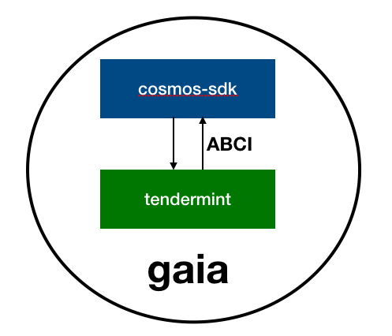
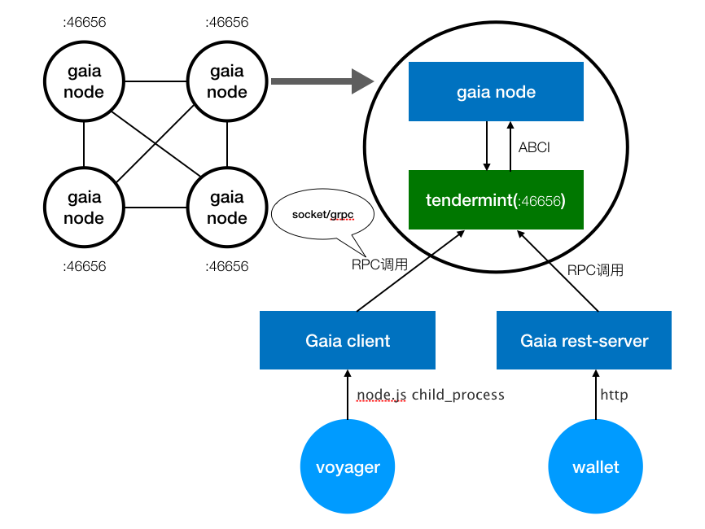
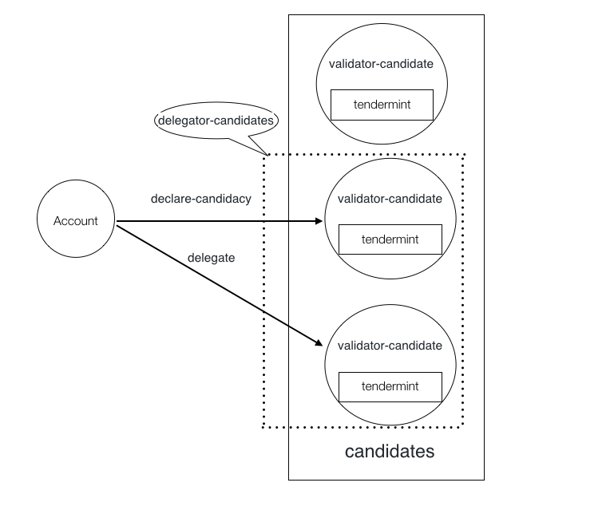

# gaia
A demonstration of the Cosmos-Hub with basic staking functionality.

+ [gaia简介](#gaia简介)
  + [gaia是什么](#gaia是什么)
  + [gaia架构](#gaia架构)
  + [gaia功能](#gaia功能)
    + [cosmos-sdk](#cosmos-sdk功能)
    + [gaia](#gaia功能)
  + [gaia代码结构](#gaia代码结构)
  + [gaia更新](#gaia更新)

+ [gaia私链搭建及配置详解](#gaia私链搭建及配置文件详解)
  + [私链搭建](#gaia私链搭建)
  + [配置详解](#配置文件详解)
  + [功能演示](#功能演示)

## gaia简介

### gaia是什么
  + gaia是cosmos一个project——具有基本的staking功能的Cosmos-Hub的范例。    https://github.com/cosmos/gaia

  + gaia也是cosmos-hub目前的测试网络使用名，官方发布过两个测试网络gaia1和gaia2。

### gaia架构

#### 系统架构

  

#### ABCI实现方式：
   + local&nbsp;&nbsp;&nbsp;&nbsp;本地方法调用
   + grpc&nbsp;&nbsp;&nbsp;&nbsp;http2长链接&nbsp;&nbsp;&nbsp;&nbsp;grpc序列化
   + socket&nbsp;&nbsp;&nbsp;&nbsp;tcp常连接 &nbsp;&nbsp;&nbsp;&nbsp;go rpc序列化

   https://github.com/tendermint/abci/tree/master/client

  + 运行时状态

  

### gaia功能
  + cosmos-sdk功能
  + gaia功能
    + stake tx
      + declare-candidacy: create new validator-candidate account and delegate some coins to it
      + edit-candidacy: edit and existing validator-candidate account
      + delegate: delegate coins to an existing validator/candidate
      + unbond: unbond coins from a validator/candidate
    + stake query
      + candidates: Query for the set of validator-candidates pubkeys
      + candidate: Query a validator-candidate account
      + delegator-candidates: Query all delegators candidates' pubkeys based on address
      + delegator-bond: Query a delegators bond based on address and candidate pubkey
    

### gaia命令

##### node
The Cosmos Network delegation-game blockchain test

##### client
Gaia light client

#### rest-server
REST client for gaia commands

#### gaia代码结构

https://github.com/cosmos/gaia

| testnet | gaia version |
| -----   |:-----------: |
| gaia1   | v0.2.0       |
| gaia2   | v0.5.0       |
| now     | v0.6.0       |

#### gaia更新

[cosmos roadmap](https://cosmos.network/roadmap)

gaia 依赖关系

| branch  | version | cosmos-sdk | tendermint |  
| ------- |:-------:| -----:     | -----:     |          
| master  | 0.5.0   | develop    | v0.15.0    |
| develop | 0.6.0   | tm-develop | develop    |

CHANGELOG
+ [tendermint](https://github.com/tendermint/tendermint/blob/master/CHANGELOG.md#0160-february-20th-2017)

+ [cosmos-sdk](https://github.com/cosmos/cosmos-sdk/blob/master/CHANGELOG.md)

+ [gaia](https://github.com/cosmos/gaia/blob/master/CHANGELOG.md)

## gaia私链搭建及配置文件详解

#### gaia私链搭建
  + [安装及私链搭建](Local-Test)

#### 配置文件详解
  + 文件结构
  + [priv_validator.json](config/priv_validator.json) 和 [genesis.json](config/genesis.json)
  + [config.toml](config/config.toml)

#### 功能演示
  + gaia stake演示
